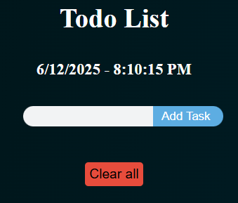
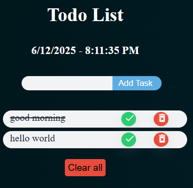

# 📝 ToDo List App


A sleek and responsive ToDo application that lets you manage your daily tasks with ease. Built using HTML, CSS, and JavaScript, this project supports all essential task operations including create, update, delete, and clear all.

 Live Demo: [codertodoweb.netlify.app](https://codertodoweb.netlify.app)

---

## 📸 Screenshots

### Task Input View


### Completed and Active Tasks


---

## 🚀 Features

- ✅ Add new tasks
- ✏️ Mark tasks as completed (with strike-through)
- 🔄 Update task status
- 🗑️ Delete individual tasks
- 🧹 Clear all tasks
- ⏰ Live Date and Time display

---

## 🛠️ Tech Stack

- **Frontend**: HTML, CSS, JavaScript,React
- **Deployment**: Netlify

---

## 📦 How to Run Locally

1. Clone the repository:
```bash
git clone https://github.com/your-username/your-repo-name.git
```

2. Navigate to the project folder:
```bash
cd your-repo-name
```

3. Open `index.html` in your browser.

### 🙋‍♂️  Author
**[Akash Shukla](https://github.com/dev007-sudo)**  
Computer Science Engineer


### 🧾 License
This project is open source and available under the MIT License.
